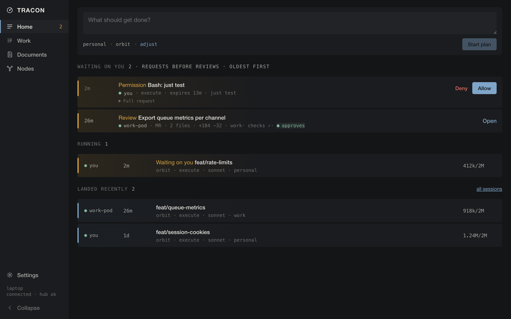
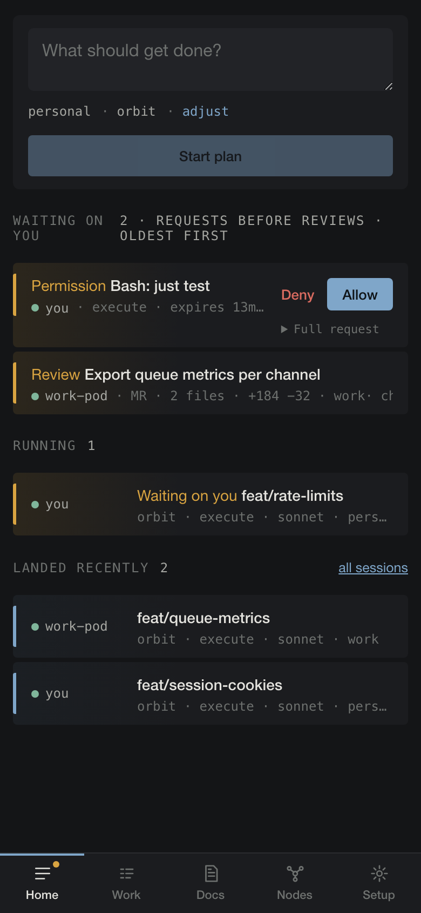

# tracon

**A self-hosted workspace for coding agents.** Run work on your machines,
intervene from anywhere, and keep ownership of the results and history.

Coding with an agent should not mean keeping a terminal open and watching every
turn. Start with a repository and a prompt. Let the node keep the session running
when you close the client, then return from a browser or phone to see what changed,
inspect the evidence, and answer the decisions that need you.

tracon is built for one operator, not an organization chart of agents. A laptop
node is a complete installation, and almost everything above a session is
optional: an always-on server, reaching it from off the machine, a mesh of other
nodes. Work items and phases are there for work that benefits from structure, not
paperwork before every conversation; review is a gate on publishing, not on
working; memory is opt-in and waits for your yes before it is kept. A plain prompt
against a repository uses none of them. The goal is useful work completed with
fewer interruptions, not the largest number of agents running.

The node supervises existing harnesses (OpenCode and Claude Code), rather than
running its own model loop. Managed agents work in isolated workspaces; credentials stay
with the node, which decides what it will do on their behalf. Proposed publication
comes with a diff and revision-bound evidence, not just an agent's assurance that
it finished. External harnesses can use the broker too, with a deliberately
narrower guarantee: they never need its credentials, but do not gain its isolation.

Your work should outlive the tool. Workspaces outlive sessions, documents can be
exported, and candidate packages carry their files and evidence outside the node.
These are existing escape routes, not a promise of live session migration or a
complete portable archive; broader export and cross-node continuity are on the
[roadmap](docs/ROADMAP.md#everyday-work-and-portability).

This project is built with coding agents. The name comes from terminal radar
approach control: it issues clearances, but never flies the aircraft.



**What it is.** A single static Rust binary. Each node supervises local agent
harnesses, enforces policy, brokers credentials, and serves the interface above.
A single node works without a hub. Optionally, nodes dial out to a small hub that
relays end-to-end-encrypted frames so one interface can reach work on other nodes.
Laptops, servers, and Kubernetes pods run the same binary.

**What it is not.** Not a coding agent — it drives OpenCode over its server API
and Claude Code over stream-json, and contains no model loop. Not multi-user — one operator holds the keys.
Not an IDE — the diff is the unit of review, and there is deliberately no file tree
and no editor of its own.

**The harnesses.** **OpenCode** is the primary one, driven through its native
server API: one isolated `opencode serve` per session, every route decided by the
node's own gateway, every tool call asked for rather than saved as a standing
grant, and the session's events synthesised by the node. Its native web UI is an
*optional advanced view* on a session tracon is already supervising — a second,
unprivileged window on the desktop, a framed route inside the installed app on a
phone — never the way tracon itself is used, and a node without the bundle simply
does not offer it. A terminal comes with that view as a capability you grant to one
session and one workspace: default-denied, revocable, and never a general shell on
the node. **Claude Code** is retained as a second supported harness over the
stream-json control protocol. It has no native UI, so the advanced view, the
terminal, and streaming either of them to another node are OpenCode-only. One node
runs one harness image, chosen by `[harness] id`. Subscription sign-in does not run
in either: the node speaks the Anthropic and ChatGPT OAuth flows itself.

What is built but not yet proven against a real credential, device, cluster, or
published release is listed in one place:
[the roadmap's live checklist](docs/ROADMAP.md#live-proofs-still-the-operators).

## Five minutes to a running node

**On a laptop, the desktop app is the whole install.** Take the `.dmg` (macOS on
Apple Silicon) or the `.AppImage` (Linux x86_64) from the
[latest release](https://github.com/cosmicspork/tracon/releases/latest). The
macOS bundle is unsigned: the publisher holds no Apple Developer ID and does not
intend to, so what authenticates every desktop asset is its GitHub build
provenance attestation, published beside it and checked by the app itself before
any self-update. The cost is that Gatekeeper asks once, on first open — right-click
the app and choose Open, or on macOS 15 and later allow it under System Settings >
Privacy & Security > Open Anyway (`xattr -d com.apple.quarantine
/Applications/tracon.app` does the same) — and it never asks again. The app opens on a
setup page that looks for rootless Podman — the boundary
the agent runs inside; on a Mac that is `brew install podman`, then
`podman machine init` once — and then, with one button, installs the `tracon`
command in `~/.local/bin` and a user service (launchd, or systemd --user) that runs
the node whether or not the app is open. From then on the window is the node's own
interface. An OpenCode session can also open that harness's own interface, in a
second window that holds none of the first one's privileges: it is granted no IPC
at all, it can navigate only to the node's OpenCode UI origin, a link off that
origin opens in your browser instead, and the boot token that gets it in travels
in the URL fragment, which no request carries.

The app keeps itself and the node current. It checks GitHub Releases at launch and
replaces itself from Settings or the tray only after a verifier it carries has
checked the download's GitHub build provenance against this repository and its
release workflow; there is no code-signing identity to compare. An update it
fetches itself is unpacked without a quarantine flag, so macOS does not ask again. On the
next launch it moves the CLI and the service onto the node it now carries —
restarting the node only once no session is running, and saying so in the tray
while it waits — and rebuilds the boundary images if their definitions changed.

**On a server or a VM,** one line fetches the binary, verifies its build provenance
with the GitHub CLI (`gh` must be installed for this), and installs it (static
Linux x86_64, or macOS on Apple Silicon):

```sh
curl -fsSL https://raw.githubusercontent.com/cosmicspork/tracon/main/install.sh | sh
```

Then, with rootless Podman on the machine:

```sh
tracon setup                   # build the harness network and gateway (definitions ship in the binary)
tracon check-boundary --deep   # prove the boundary, including an egress probe from inside it
tracon service install         # run this binary as the node under systemd or launchd
```

If `tracon setup` cannot find podman — a node started from a desktop launcher
inherits a minimal PATH — set `podman` under `[boundary]` in `node.toml` to its
full path. The interface says so too, in the refusal it shows. On macOS the node
starts the podman machine itself when it finds it stopped; create one once with
`podman machine init`. After an upgrade, `tracon setup` rebuilds any image whose
definitions changed, and the boundary check refuses until it has.

Open `http://127.0.0.1:7420`. **Settings** groups configuration into Connections,
Channels, Devices & notifications, Mesh, Permissions & policies, and Maintenance.
**Nodes** compares connectivity, isolation, runtime, models, and compatibility;
its management links open the relevant Settings section.
Channel-scoped skills and instructions live under **Channels**; their launch
manifests remain owned by the serving node.

Home offers two paths: prepare this node, or use a ready peer on a shared channel.
A local isolation failure or missing local provider does not block that peer.
Choose the runner and channel first, then the repository, model, and optional
session cap. Local setup shows the missing prerequisites; joining an existing
mesh is separate from connecting a browser or registering it for notifications.

A session runs one phase of an optional work item, or none at all: a *plan*
session reads and ends by writing the plan; an *execute* session does the work and
submits a diff for your review; approving publishes it with a credential the agent
never held.

A node that fails `check-boundary` refuses to run harnesses and says which check
failed. That refusal is the design working, not a bug to route around.

## From your phone

Everything below assumes the flagship case: the node on a machine at home, the phone
anywhere. The browser keeps its login in a `Secure` cookie, so the node must be
reachable over HTTPS — plain HTTP on the LAN is not supported, and the login screen
says so instead of silently failing. The easiest HTTPS in front of a laptop is
[Tailscale Serve](https://tailscale.com/kb/1242/tailscale-serve):

```sh
tailscale serve --bg 7420                                # HTTPS at https://<machine>.<tailnet>.ts.net
tracon auth issue --url https://<machine>.<tailnet>.ts.net
```

`auth issue` prints the operator token once — and, given `--url`, a QR code. Scan it
with the phone's camera: the token rides the URL fragment (never sent to any server,
stripped from the address bar before login), the browser exchanges it for a cookie,
and you are in. Add the page to the Home Screen — iOS only delivers push to an
installed web app — then open **Nodes** and switch on **Push to this device**. The
node pushes straight to the phone's push service, sealed to the phone's own key.

Any ingress or reverse proxy that terminates TLS works the same way; `localhost`
counts as secure, which is why the laptop needed no ceremony. Issuing a token again
rotates it and logs every client out. `tracon auth revoke` returns the node to
loopback-only.

An OpenCode session's own interface opens on the phone too, at
`/sessions/{id}/opencode` — inside the installed app, not handed off to Safari or
Chrome. It is the node's separate OpenCode origin in a frame, so the page you are
holding lends it nothing: no cookie of yours, no DOM, no command. The capability that
gets it in is single-use, lives in the URL fragment, and reaches only that frame; the
cookie it becomes is partitioned to this app, so it works with third-party cookies
blocked and exists nowhere else. Put the phone down and come back and the shell
re-checks the session before it trusts what is on the screen: a session that ended
says so, and an expired capability offers a fresh one.

### Start on the phone, pick it up on the laptop



The phone is a full seat, not a viewer. From it you can add a work item, start a
plan or execute session, answer the agent's permission requests, read the diff and
approve or reject it, connect a provider (the sign-in happens where your password
manager lives), enroll a new node, and kill a session (with a confirm — a stray
thumb is likely).

Sessions live on the node, so continuity is free: open the same session on the
laptop and the log is there, the queue is there, and **the prompt you half-typed on
the phone is waiting in the box** — drafts are held by the node, not the browser. A
push notification opens the queue at the thing that needs you. The one deliberately
desktop-only job is editing a diff by hand; the phone is told so in words, not with
a disabled button.

What a session looks like mid-flight — the permission card inline, the draft in the
box:


## Starting work

Work starts by typing what needs doing. A plain prompt starts an execute session
with no work item at all: the text is held as a durable draft and sent once the
harness comes up, so a closed tab or a lost connection loses nothing. Turning that
same prompt into a tracked work item — with a title, a plan phase, and a place other
sessions can pick it up from — is explicit, through **Adjust → Plan work item**
or `/api/compose`. Either way nothing about the workflow is mandatory: the channel's
phase bindings are presets, not requirements, supplying a model and budget only when
the session does not name its own; if neither does, the node falls back to a model
already in its catalogue and records which source actually won as the session's
`model_source`. **Adjust** opens repository, phase, model, and node as fields when a
session needs something other than the usual. The session is killed at its budget,
checked at each turn's end; a channel at its daily ceiling starts no session at all.

**A work item may carry a brief, and most never will.** It is one document —
`brief-<item>` on the Documents screen, linked from the item — saying who the work
is for, what their problem is, what was read to reach that belief, what bounds the
answer, what would make it good, and what is still open. Every line is marked
`observed` (the customer said or did this), `inferred` (someone reasoned to it) or
`decided` (you chose it), and points at what it rests on: a document, a session, a
piece of evidence, another item, a URL. The node resolves those and says which ones
it has never seen rather than showing a link that goes nowhere. A session reads the
brief with `brief_read`; a line it wants to add goes through `brief_note`, which
comes to you for approval, and which refuses outright to record a decision in your
name or an observation with nothing to point at. Nothing requires a brief: an item
without one is worked from its description and its plan, exactly as before.

The model picker uses the selected runner's connected, channel-bound providers.
A connected provider whose models never appear has a stale catalogue — the probe
runs when the provider connects, and can miss if the harness was not up yet or the
credential arrived by handoff: **Settings → Connections → Refresh models**, under the
provider rows, asks the harness again without disconnecting and signing in a second
time, and reports what came back per provider. The catalogue itself is
declared, not discovered: **Settings → Connections → Declared models** edits each
provider's model list (id, picker name, context and output limits, reasoning,
attachments) and writes it to `node.toml`; sessions started after the next restart
see the change.
When a peer runs the task, enter a repository path on that peer: local clones and
browser imports are not transferred. Changing runner or channel clears the old
repository selection; changing model scope clears stale model and budget overrides.

**Repositories can come from a forge.** Give the broker a `gh` or `glab` credential
(the same one publishing uses) and the form lists your GitHub/GitLab repositories
and clones the one you pick into the node's own root — the token reaches git only
through the environment, never argv, never `.git/config`, never the stored remote
URL. `GH_HOST`/`GITHUB_API` and `GITLAB_HOST` in the credential point the same
machinery at an enterprise forge.

```toml
# a plaintext file for `tracon credential import`, chmod 600
[credentials.gh]
channels = ["personal"]
[credentials.gh.env]
GH_TOKEN = "…"
```

**Nothing on this machine is bind-mounted into the boundary.** A session works in
a runtime-owned volume: a forge clone the node made, or files you pick in the
browser, which are copied in once (bounded in size and count, symlinks and Git
metadata refused) and never written back. The harness sees `/work` and no host
path; your Git configuration, hooks, and credentials stay outside. A workspace
outlives its session — start another on it, export a checked snapshot, or download
it as a zip — and publication happens from that snapshot through a separate,
credential-bearing repository the node owns, never from the agent's clone.
Dependency preparation runs first as its own credential-free command in an
isolated cache: a `devcontainer.json` may name a digest-pinned image, but hooks,
mounts, sockets, and privilege in it are refused rather than partly honoured, and
`[runtime] approved_images` is the operator's list of anything else acceptable.

### Review before publish

An agent has no forge token and never runs `gh` or `glab`. To publish it commits,
submits, and waits: the node snapshots the workspace volume itself, runs the
project's checks against that snapshot in a throwaway container, and refuses a failure or an oversized
diff before you ever see it. You approve, reject with a reason, or — on a desktop —
edit the diff and send it back as a request for changes. Approval publishes exactly
the reviewed bytes with the brokered credential; if the branch moved since submit,
approval is refused and the changed files are named. `tracon provenance <sha>`
answers, later, which model, which prompts, which approval and which policy shipped
a commit.

What you review is a *candidate*: an immutable capture of the commit's tree,
kept even after the review moves on. Required checks come only from the node's
configuration (a repository's own `.tracon/checks` cannot replace them) and run
against a writable copy of the candidate in the runtime; each run keeps its
command, inputs, the image the runtime actually executed, the log, and the outcome.
A resubmission that changes only the title, description, or ticket prose reuses
the code evidence of the same candidate and says so; changed code, checks, or
image runs again. Every decision — yours or a policy grant's — is recorded
against the revision it decided, with the requirements pinned as they were when
it was submitted. A curated demonstration (a document with commands, output,
and images) can be attached beside the authoritative record; it is linked and
hashed, never executed, and flagged stale if the document changed since.

**Work → Evidence** browses captured candidates without requiring an ID. Reviews,
sessions, and work items link to the corresponding owner and channel. Peer detail
shows that owner's recorded checks, deployments, and browser proof read-only;
artifact downloads and new QA actions remain on the owner. A missing local
candidate is not evidence that a peer has none.

### Asking, pinging, and complaining

Three tools let an agent reach you without pretending a question is a permission.
`ask_operator` posts a free-text question, optionally with choices, and blocks
until you answer it from the queue or the session; the question survives the
client disconnecting or the node restarting, and a retry with the same
`request_id` picks the existing answer up instead of asking twice. Silence is
not consent, and an answer widens nothing. `notify_operator` asks for a real
push to your devices — title, message, and a link back — rate-limited and
deduplicated, and reports only what the push service said, never that you saw
it. `report_issue` drafts a bug report against tracon itself, with expected and
actual behaviour, reproduction, versions, and attachments, secrets scrubbed; the
draft sits in the queue for you to read before you authorize opening it on
GitHub through the broker. None of the three pauses the session.

**Devices & notifications** manages this browser's subscription and device tests.
Shared channel notification rules live under **Channels** and have an explicit
mesh scope. Push-service acceptance is not phone display or human acknowledgement.
No registered devices means no device delivery can be demonstrated.

### Pause and stop

**Pause** and **Stop** work differently depending on who is driving the harness.
For a session the node itself launched, pause waits for the turn in flight to
finish, then blocks new prompts and permission replies until you resume it —
stop tears the container down outright, and both survive a node restart because
the fence is durable state, not an in-memory flag. For a session attached from
your own harness over `tracon external`, the node never held the process: pause
and stop only fence its brokered tool access, so the interface labels the control
"Stop broker access" rather than "Stop", and a stopped attachment reads "Broker
access stopped" rather than "Killed" — your own client keeps running until you
end it. A watchdog pauses a session on its own after repeated harness-turn
failures, with the reason on the record, rather than restarting the same loop
indefinitely.

### QA verification

Once a candidate is captured, an operator-configured QA target can deploy and
prove it before anyone reviews the diff. Deploy never creates a GitLab pipeline
on a moving ref — it finds the pipeline GitLab already ran at the candidate's
exact commit and plays the configured manual deploy job inside it, or refuses
outright if no such pipeline exists. Browser verification then runs a real,
headless browser against that deployment inside its own network boundary: the
container reaches only the QA target's configured origin(s) for that one run,
nothing else, through a dedicated egress gateway distinct from the harness's
own — the Kubernetes backend has no such gateway yet, so QA browser runs are a
Podman-only capability today. A scenario's steps and assertions are declarative
— no script, no arbitrary URL — and a dedicated test-account credential may
only be filled into a password-type input, never screenshotted while its form
is still on screen. Every deployment observation, browser run, assertion, log,
and screenshot attaches to the candidate as evidence, and a stale deployment
(the target moved since the browser ran) is marked so rather than silently
trusted. Deploying and verifying are their own scoped authority grants, kept
separate from merge, publish, and ticket-transition grants.

### Repository-derived prototypes

A prototype is a static, sandboxed preview built from a candidate's own
repository rather than hand-authored: the node prepares the pinned build
image the same way a check would, runs the operator-configured build command
in that isolated environment, and imports the resulting HTML/asset output
through the same bundle importer and capability-scoped viewer as any other
document — no host file serving, and no bind-mount exception for the
prototype's own assets. Each build records its source revision and build
image so a prototype is always traceable to the exact candidate it came from.

## Using the tools from your own harness

Everything above is about harnesses the node starts. A harness you start
yourself — a terminal on this machine — can use the same tools, without ever
holding a credential. Turn it on, then register the node once per channel:

```toml
[external]
enabled = true
```

```sh
tracon external show     # prints the line below, for each channel
claude mcp add --transport http tracon-work http://127.0.0.1:7420/mcp/external/work
```

It gets the channel's tools: the database, the forge and the tracker, the
node's documents and memory, the ledger, and review. `submit_review` takes the
path of your worktree; its repository must live under `[external] repo_roots`
(`~/src` unless you say otherwise), so a linked worktree in a scratch directory
is fine. The node captures the diff from it, skips the container checks (you
ran them where your toolchain is), and on approval pushes that branch and opens
the change with the brokered credential, exactly as for a session it started.
`work_close` takes the item's id, and refuses one a running session holds. A
verb the policy does not name reaches your home as a card, exactly as it would
from inside the boundary, and the call waits for you.

For an investigation or handoff with no code to publish, use **`submit_report`**.
It puts a narrative report in the operator queue and requests a notification,
without a repository, candidate, push, or forge change. The operator can acknowledge
it or request changes; **`report_status`** returns that feedback. Resubmit the same
report ID to revise it. Decisions are tied to the inspected content, so stale
acknowledgements cannot approve a newer report. Acknowledgement is a human action,
independent of whether a push service accepted its notification.

What it does not get is the boundary. That harness runs as you, on your
machine: the promise here is that it never needs the credential and that every
call it makes is decided by policy and written to a session log, not that it
could not have read the credential by other means. `docs/reference/external-harness-notes.md`
says what that changes; a node holding production credentials should leave
`[external]` off.

## More nodes


Nodes see each other through the hub — an always-on relay that routes sealed frames
and can read none of them. A hub outage costs latency, never work: local sessions
continue and queued items deliver when it returns.

```sh
# the hub, once, somewhere always-on (also ghcr.io/cosmicspork/tracon-hub)
TRACON_HUB_ADMIT=<first node id> TRACON_HUB_DATA_DIR=/var/lib/tracon-hub tracon-hub

# the first node
tracon mesh id                                # for TRACON_HUB_ADMIT
tracon mesh init --hub https://hub.example.com
tracon channel create personal
```

To enroll another machine, open **Settings → Mesh** (or use `tracon mesh invite`).
Choose the existing channels to share and create an invitation. It includes a QR,
code, and this line for the new machine:

```sh
curl -fsSL https://raw.githubusercontent.com/cosmicspork/tracon/main/install.sh | TRACON_ENROLL='<invitation url>' sh
```

That installs, enrolls (you confirm the fingerprints match — from the phone if that
is where you are), sets up the boundary, and installs the service. Paste it into a
cloud console's user-data and a fresh VM comes up enrolled.

**Compare both fingerprints before admission.** Enrollment hands the new member
the selected channel keys and signed policy, not the private signing key. Logging
a browser into an existing node does not enroll another machine or grant it keys.

**A reachable node can be configured remotely.** Open its management link from
Nodes, then use **Settings → Connections** to connect a provider or share a
credential. Provider login stays on the selected node; credential listings show
names and bindings, never secret values. Sessions can be started, prompted,
reviewed, and stopped from another channel member.

Mesh invitations, admission, removal, and explicit hub channel sharing require
administrator authentication, including on loopback, and work from an authenticated
remote browser. **Maintenance** service changes additionally require local access,
the fixed supported supervisor, and no active sessions. A scheduled restart is not
a completed restart; unsupported or ambiguous service identities are refused.

**Permissions & policies** separates verified installed files from the running
process policy. On a managing node, initialize a missing policy, or preview and
sign an edit with its existing key. Apply installs only those exact signed bytes
against the preview's original baseline. It never rotates trust keys or overwrites
a partial/custom installation during initialization. Selected peers remain
unconfirmed until each returns a matching authenticated installation receipt;
retry resends the stored bundle rather than silently resigning it. Legacy or
missing compatibility metadata is unknown, not success.

**Channels** are the isolation: a channel is a key, a node that was not handed the
key cannot read that channel's work, and a meshed node refuses to start a session on
a channel it holds no key for. Credentials bind to channels (and optionally to
nodes), so the work channel's Jira token exists only where work happens. Whether a
channel notifies your phone is a binding too:

```sh
tracon channel bind work notify.enabled=false   # the desktop tray is enough for work
```

**Handing work to another node** does not require the mesh, work items, or moving
a live harness: from a session screen, export makes a signed package —
the candidate's exact commit tree, its check/review evidence, and any documents or
memories you select — bound to that candidate's identity so a receiver cannot be
handed unrelated bytes under its name. Deliver it as a file or, over the mesh,
queue it to a specific node; importing it stages files into a fresh runtime-owned
workspace (never a bind mount) and starts a new session with no relationship to
the original beyond that immutable snapshot. A repeated import reuses the
materialized workspace rather than leaking another one, and each package can be
imported once. The hub can also roll up a channel's session/queue counts for
nodes it has been explicitly handed that channel's key for — opt-in per channel,
and revoked the moment the hub loses that key.

## Glossary

| | |
|---|---|
| **node** | One `tracon serve`, on any machine: supervises harnesses, serves the interface. |
| **hub** | The always-on relay nodes dial out to. Sees ciphertext only. |
| **mesh** | The nodes enrolled against one hub, under one operator. |
| **channel** | A context (`personal`, `work`) that is also an encryption key. Bindings hang policy off it. |
| **harness** | The coding agent a node runs — OpenCode or Claude Code — inside the boundary. |
| **boundary** | The container/network setup that makes the harness's isolation real, proven at startup. |
| **broker** | The sealed credential store. Agents get tools that use credentials, never the credentials. |
| **work item / ledger** | The replicated to-do list, optional per session. A session that names one runs one phase of it. |
| **phase** | `plan` (ends by writing the plan), `execute` (does the work, submits), `review` (a fresh session reads the diff). |
| **queue** | What is waiting on you, across all nodes: the first thing the home shows under the composer. |
| **promotion** | A lesson an agent retained, waiting for your nightly yes/no before it enters memory. |
| **corpus** | Markdown documents, HTML bundles, and memories; replicated and meant to outlive the tooling. |
| **policy** | The signed bundle deciding what runs unasked, what is refused with a reason, and what reaches the queue. |

## Reference

### Commands

| | |
|---|---|
| `tracon serve [--listen]` | run the node |
| `tracon setup [--rebuild] [--ui-bundle <tarball>]`, `check-boundary [--deep]` | the boundary, and OpenCode's UI bundle — fetched from the release, or installed from a file offline (also on the Settings screen) |
| `tracon service install\|uninstall\|status\|restart` | the platform supervisor (the desktop app runs these for you) |
| `tracon auth issue [--url]\|revoke\|sessions` | off-machine access; `--url` prints the login QR |
| `tracon external show\|detach <channel>` | a harness you run yourself, using this node's tools |
| `tracon push ls\|rm <id>\|test` | the phones this node pushes to |
| `tracon mesh id\|init\|invite\|members\|remove\|admit`, `enroll` | the mesh |
| `tracon channel create\|list\|bind\|share` | channels and their bindings |
| `tracon credential import\|ls\|rm\|share` | what the broker holds (import is also on Settings) |
| `tracon doc import\|ls\|get\|put\|rm\|export\|reindex` | Markdown documents, and rebuilding the vector index from them; import, preview, replace, download, archive, and delete HTML bundles in Documents |
| `tracon session show <package> [--jsonl]` | read a session package offline, with no node running |
| `tracon session state\|backup [--quiesce]\|upgrade-state --to\|restore` | a session's own harness state: what it is, verified copies of it, a migration on a clone, and putting one back |
| `tracon session archive-legacy\|reopen --harness` | put sessions from a retired harness away read-only, and carry one forward onto a supported one |
| `tracon skill import <dir[#git-rev]>\|ls\|rm` | skill packages in a channel's launch manifest |
| `tracon memory ls\|add\|rm\|recall\|batch` | memories, and the promotion batch on demand |
| `tracon work add\|ls\|ready\|show\|close\|dep\|rm` | the ledger |
| `tracon policy keygen\|init\|sign\|push\|show` | the policy bundle |
| `tracon metrics [--channel] [--days]`, `provenance <sha>` | what happened |

Most commands talk to the running node over its API, and `TRACON_URL` and
`TRACON_TOKEN` point them at a remote node. The ones that act on this machine itself
ignore both: `setup`, `check-boundary`, `service`, `enroll`, `mesh id`,
`credential import|ls|rm`, `policy keygen|init|sign|show`, and `session show`,
which reads a file and needs no node at all. `--help` on any of them says more.

### Configuration

`node.toml` is optional; every key has a default. The full set, with defaults:

```toml
node_name = "<hostname>"            # how this node is named in the mesh

[harness]
id = "opencode"                     # "opencode" or "claude"; an unknown id refuses to start, and a
                                    # retired one is refused by name with its migration path
                                    # (docs/RECOVERY.md) rather than a bare unknown-harness error.
version = "1.18.30"                 # pinned; empty means the version this node's harness image
                                    # installs. Checked twice — `--version` in the runner, and the
                                    # handshake's own report — and a session whose harness reports
                                    # another version, or a protocol revision this node was not
                                    # written against, fails with that reason rather than running.
tools = []                          # the only tools a session may use; empty is the harness's own set
                                    # (a list without the harness's shell leaves nothing to commit,
                                    #  so nothing to review)

[boundary]                          # the rootless-Podman boundary a laptop establishes
podman = ""                         # empty: found on PATH, then the usual install locations
network = "tracon-int"
subnet = "10.89.0.0/24"
gateway_ip = "10.89.0.2"
gateway_container = "tracon-gw"
gateway_image = "localhost/tracon-gateway"
harness_image = "localhost/tracon-harness-opencode"  # "localhost/tracon-harness-claude" with
                                    # [harness] id = "claude"
start_machine = true                # macOS: start the podman machine when it is stopped
# selinux_label_disable = true      # only if the boundary check says the labels fight you

[gateway]
allow_hosts = ['^api\.anthropic\.com$', '^api\.openai\.com$', '^chatgpt\.com$',
               '^auth\.openai\.com$']  # harness egress; subscription sign-in runs in the node
proxy_port = 8888
forward_port = 7421
# harness_listen = "127.0.0.1:7421" # or a socket path; the platform default is right

[session]
budget_tokens = 2000000             # per session
permission_timeout_secs = 900       # an unanswered ask is a deny
# default_channel = "work"          # the channel the composer starts on; empty is no preference
claim_grace_secs = 60               # a review claim lapses this long after the client vanishes
# worktree_root = "/private/tmp"    # on macOS; the system temp directory elsewhere

[runtime]
kind = "podman"                     # or "kubernetes", for a pod-hosted node
# [runtime.kubernetes]              # namespace, harness_image,
                                    # state_claim, state_mount, harness_home, uid, gateway_host
# approved_images = []              # digest-pinned project images preparation may use besides the harness image

[providers.anthropic]               # anthropic, openai and openai-codex are built in; add others the same way
credential = "anthropic"
upstream = "https://api.anthropic.com"
shape = "anthropic"                 # or "openai", "openai-codex"; the shape also fixes which
                                    # methods and paths the gateway will lend the credential to:
                                    # inference, token counting, embeddings and the models list,
                                    # never the provider account behind the key
# login = "anthropic"               # the subscription sign-in the node runs: "anthropic", or "openai" for ChatGPT/Codex
# models = [                        # what the picker offers and OpenCode is told; a built-in provider
#   { id = "claude-opus-5", name = "Claude Opus 5", context = 200000, output = 64000, reasoning = true, attachment = true },
# ]                                 # left without models gets the current generation; `models = []` declares none
# [providers.anthropic.price]
# input_per_mtok = 3.0
# output_per_mtok = 15.0

[consulta]                          # the database MCP tools, run as a sidecar
# one credential per database: `consulta` is the default, `consulta-<profile>` any other;
# a channel holding more than the default offers the tools a `profile` argument
command = "uv"
args = ["run", "--project", "<home>/src/consulta", "consulta"]   # paths here are literal: only repo_roots and export_dir expand ~
timeout_secs = 60

[publish]                           # the binaries the node runs to publish an approved review
gh = "gh"
glab = "glab"
git = "git"

[mesh]
# hub_url = "https://hub.example.com"   # set by tracon mesh init / enroll
heartbeat_secs = 60
poll_secs = 30
command_timeout_secs = 15
# renew_credentials = true          # on an always-on node: renew shared subscription sign-ins first

[memory]
promote_at = "02:00"                # the nightly promotion batch

[supervision]
checks = ["just check"]             # run against a snapshot of the workspace before a review is accepted
timeout_secs = 900

[review]
max_diff_lines = 800                # a bigger submission is refused before any check runs
max_files = 40

[qa]                                # no targets by default: QA has no implicit environment
# [qa.targets.<name>]               # see QA targets below. A name containing "production" is refused.

[notify]
# contact = "mailto:you@example.com"    # what a push service may write to about this sender

[external]                          # a harness you run yourself, using this node's tools; off unless enabled
enabled = false
idle_timeout_secs = 3600            # an attachment with no call for this long is closed (at least 60)
repo_roots = ["~/src"]              # a worktree put up for review must belong to a repository under one of these

[docs]
# export_dir = "~/notes"            # Markdown only: <slug>.md, archived ones under archive/
export_channel = ""                 # empty: [session] default_channel
export_every_secs = 1800            # at startup, then this often (at least 60)
preview_listen = "127.0.0.1:7422"   # isolated HTML capability origin
# preview_url = "https://preview.example.com" # public origin when a reverse proxy terminates TLS

[embed]                             # semantic search; off unless enabled
enabled = false
base_url = "http://127.0.0.1:8080"  # an OpenAI-shaped /v1/embeddings
model = "bge-m3"
dim = 1024                          # must match the model; changing it rebuilds the index
# api_key_file = "<home>/.config/llama-server.key"
# provider = "anthropic"            # instead of base_url: through the gateway, so the channel ceiling applies
batch = 16
timeout_secs = 60
```

For `[embed]`, a local `llama-server --embedding -m <model>.gguf` is enough; BGE-M3
and Qwen3-Embedding-0.6B (which wants `pooling = last`) are the models it was built
against. Without an endpoint, search is text-only and the Documents screen says so.

HTML bundle previews are served from `preview_listen`, never the operator
origin, and embedded with `sandbox="allow-scripts"`. Set `preview_url` when a
reverse proxy exposes that listener; it must be an HTTP(S) origin distinct from
the operator origin. Preview capabilities expire after an hour idle and are
invalidated when their document is replaced or deleted. The preview policy
permits inline and bundle-local scripts, styles, images, and media, but denies
network connections, forms, nested frames, workers, and plugins. Fonts that
must work in the opaque-origin sandbox should be embedded as `data:` URLs.

In Documents, import an HTML file or folder, replace it, open a full-window
preview, or download the original file or ZIP bundle. Imports allow up to 256
files, 20 MiB total, and 16 MiB per file. A folder needs a root `index.html` or
one unambiguous HTML entry; browsers without folder selection can import a
single file. External fonts, CDNs, and live API connections are intentionally
blocked, not fetched automatically. HTTPS operator access needs a distinct HTTPS
preview origin configured with `preview_url`.

CLI import, put, and export remain Markdown-only. Agents can read HTML through
`doc_read`; HTML creation and replacement use the operator's import flow, not
`doc_write`.

### QA targets

A QA target is where a candidate goes to be proved by a browser. Nothing about
one is inferred: the operator names the destination, attests that it is
private, and says how a candidate gets there. Two kinds do the getting.

**`kind = "gitlab"`** (the default) plays an operator-named manual job in a
pipeline GitLab already ran at the candidate's exact SHA. It never creates a
pipeline, because GitLab resolves a pipeline `ref` only against a branch or a
tag, so creating one would mean deploying whatever that ref holds now.

**`kind = "command"`** runs an argv on the node — directly, with no shell —
and observes the result through further argv. It exists because most hosts are
not GitLab, and their integration is their own CLI. The credential comes from
the broker as *environment only*: it is bound to the candidate's channel and
to this node, it never appears in an argument, and every value it holds is
scrubbed out of the recorded output before that becomes evidence. Configuration
that puts a credential-shaped word in argv, names a shell or an interpreter as
the binary, or names a filesystem path in an argument is refused at startup.
The binary is either one of an allowlist of deployment CLIs (`aws`, `cloud`,
`doctl`, `flyctl`, `gh`, `glab`, `heroku`, `helm`, `kubectl`, `netlify`,
`railway`, `render`, `vercel`, `wrangler`) or an absolute path, which says
exactly which file will run.

Placeholders in argv are `{sha}`, `{short_sha}`, `{branch}`, `{target}`, plus
anything under `deployment.args` (so `{app}` is configuration, not a tracon
concept), plus `{env_id}` and `{env_url}` in a status command. The same facts
reach the command as `TRACON_CANDIDATE_SHA`, `TRACON_CANDIDATE_BRANCH`, and
`TRACON_QA_TARGET`. A placeholder with no value is a configuration error, so an
unsubstituted brace can never survive into a command line.

A command target's equivalent of `execution_image` is a digest of the argv, the
injected environment's key names, the resolved absolute path of the binary, and
what that binary reports as its version. Upgrade the deploy CLI and the
evidence identity changes, which is what the pinned image buys the GitLab kind.

#### Laravel Cloud

Laravel Cloud is the worked example. Its CLI (`cloud`, v0.5.0) has no flag for
deploying a specific commit: `cloud deploy <app> <environment>` builds whatever
the environment's branch holds. **So the candidate must be published first** —
tracon refuses the deploy otherwise, naming that reason, rather than deploying a
branch head that may have moved. Publication already pushes the candidate's
branch and opens the pull request; the deploy asks for the publication record
that observed the forge holding the candidate's *exact* SHA, and uses its
branch name.

The default recipe below is **discovery**: it creates nothing and deletes
nothing. Laravel Cloud can be configured to open a preview environment when a
pull request opens and delete it when the pull request merges, so tracon's job
is to find the environment the automation made for the candidate's branch,
wait for it, and record it. Teardown stays the platform's; an environment that
has disappeared after the evidence was recorded is normal, not a failure. The
credential therefore needs read and deployment-status scope only.

<!-- qa-target-example -->
```toml
[qa.targets.cloud-qa]
private = true                        # the operator attests this destination is not public
identity_path = "/_tracon/deployment" # on whatever origin the discovered environment has
identity_header = "x-tracon-deployment-id"

[qa.targets.cloud-qa.deployment]
kind = "command"
env_credential = "laravel-cloud"      # broker entry, injected as environment, never in argv
args = { app = "hounddogreading" }    # supplies {app} below
command = []                          # nothing is triggered: the PR automation builds the branch
deploy_timeout_secs = 1800
poll_interval_secs = 15

[qa.targets.cloud-qa.deployment.discover]
command = ["cloud", "environment:list", "{app}", "--json", "-n"]
branch_field = "branch"
id_field = "id"
url_field = "url"
state_field = "status"
prefer_field = "createdFromAutomation"   # the automation's environment, not one made by hand
ready_states = ["running"]
origin_suffix = "laravel.cloud"          # a discovered origin must live under this

[qa.targets.cloud-qa.deployment.status]
command = ["cloud", "deployment:list", "{env_id}", "--json", "-n"]
id_field = "id"
state_field = "status"
commit_field = "commitHash"              # must equal the candidate's SHA
ready_states = ["success"]
failed_states = ["failed", "cancelled"]

[qa.targets.cloud-qa.browser]
image = "ghcr.io/cosmicspork/tracon-qa-browser@sha256:0000000000000000000000000000000000000000000000000000000000000000"
timeout_secs = 120
```

Notes on the recipe:

- **The credential.** `cloud` v0.5.0 reads its API token from
  `~/.config/cloud/config.json` and offers no token environment variable. The
  node clears the environment and sets `HOME` to node-owned state
  (`<state>/qa-command-home/<target>/`), so the operator authenticates once
  into that home — `HOME=<state>/qa-command-home/cloud-qa cloud auth -n` — or
  puts `HOME` in the `laravel-cloud` broker entry pointing at a directory only
  the node can read. Either way the operator's own `cloud` login is never what
  a deploy uses. A CLI that does take a token variable needs only the variable
  in the broker entry.
- **Flags.** Always `-n`; `--json` on reads; never `-q`/`--silent`, which would
  leave nothing to parse. `environment:get` output is never stored: a
  production environment's build command can carry a credential in clear text
  and the CLI prints it unmasked, so the node reads only the fields named above
  and redacts every brokered value out of the tail it keeps.
- **The identity check.** The application must return its deployed commit in
  `identity_header` at `identity_path`. Without that the deployment is bound to
  the candidate only by what the host said; set
  `identity_matches_candidate = false` under `[…deployment]` to accept that
  explicitly, rather than having it happen silently.
- **Repos without the PR automation.** Drop `discover`, give the target a fixed
  `origin` and `identity_url`, and set
  `command = ["cloud", "deploy", "{app}", "qa", "-n"]` with the same `status`
  block. The environment is then the operator's standing QA environment, whose
  branch the publication's push updates.

### Policy

What runs unasked, what is refused with a reason, and what reaches your queue is a
signed bundle, `policy.toml`, beside the node's state. `tracon policy init` writes
the shipped one (`node/src/policy/working-agreements.toml`) and signs it, replacing
whatever was there; to keep rules of your own, edit the file and run
`tracon policy sign` instead. The node reads it at startup, so restart it
(`tracon service restart`) after either, and `tracon policy push` hands it to the
rest of the mesh. A bundle that is missing, unsigned or malformed has no rules, and
no rules means everything is asked.

A rule allows, denies, or is left to ask. Deny wins over allow whatever the order,
and anything no rule names is asked. For a brokered tool an allow names the tool
exactly and can narrow it by argument, with `*` as the only wildcard:

```toml
[[rule]]
id = "unattended-notes"
verdict = "allow"
reason = "Keeping working notes current changes nothing the operator has not agreed to."
kinds = ["tool"]
matches = ["doc_write"]
args = { slug = ["note-*", "repo-*", "meeting-*", "inbox-*"] }
```

The shipped bundle runs the reads unattended — queries, lookups, searches,
pipeline and check status, job logs, documents, memory, the ledger, an item's
brief — and asks before every write that others see: a comment, an edited or new
ticket, a pipeline run, a document other than working notes, a line added to a
brief.

### Granting authority

Merging, publishing, transitioning a ticket, and deploying are not something a
policy rule's argument text matches unattended — they are scoped grants, made and
revoked one at a time in **Settings → Permissions & policies**, beside the signed rules
they sit under. A grant names one target (a pull request, a merge request, an
issue's exact transition, a deployment job) and, for merge, publish, and deploy,
the one commit it covers; the branch moving to a later sha makes the grant no
longer apply, rather than carrying it forward. A signed policy deny always wins
over a local grant, however narrow it is scoped — production deploys, for
instance, stay refused until the signed bundle itself changes, never by granting
around it. Revoking a grant, or letting it expire, takes effect on the next
action the node reads it for, not one already dispatched.

### Where things live

| | macOS | Linux |
|---|---|---|
| `node.toml` | `~/Library/Application Support/tracon/` | `~/.config/tracon/` |
| database, credentials, identity, harness volume, managed repos, scratch | `~/Library/Application Support/tracon/` | `~/.local/state/tracon/` |
| harness socket | (TCP `127.0.0.1:7421` through the VM) | `$XDG_RUNTIME_DIR/tracon/harness.sock` |
| the CLI, and the binary the service runs | `~/.local/bin/tracon` | `~/.local/bin/tracon` |
| the service | `~/Library/LaunchAgents/com.tracon.node.plist`, logs in `~/Library/Logs/tracon.log` | `~/.config/systemd/user/tracon.service` |

`TRACON_STATE_DIR` overrides the state directory outright — how a scratch node runs
beside a real one. `TRACON_LISTEN` or `serve --listen` moves the API off
`127.0.0.1:7420`.

### The hub

`tracon-hub` ships as a static Linux binary and as `ghcr.io/cosmicspork/tracon-hub`,
configured by environment:

| Variable | Default | |
|---|---|---|
| `TRACON_HUB_ADDR` | `127.0.0.1:8080` | listen address (the image sets `0.0.0.0:8080`) |
| `TRACON_HUB_DATA_DIR` | in memory, with a warning | durable frames, members and the replica |
| `TRACON_HUB_ADMIT` | — | node ids, comma-separated, admitted at startup so something can connect |
| `TRACON_HUB_RETAIN_DAYS` | 14 | how long frames are kept |
| `TRACON_HUB_MAX_SKEW_SECS`, `TRACON_HUB_MAX_CHANNEL_BYTES`, `TRACON_HUB_ENROLL_TTL_SECS`, `TRACON_HUB_ENROLL_RATE_PER_MIN` | 300, 256 MiB, 600, 10 | limits |
| `TRACON_HUB_REPLICA` | on when there is a data dir | the hub's own replica of what it can open |
| `TRACON_HUB_PROMOTE_AT` | `03:00` | the hub-side promotion batch |
| `TRACON_HUB_SNAPSHOT_ENDPOINT`, `_BUCKET`, `_ACCESS_KEY`, `_SECRET_KEY`, `_PREFIX`, `_EVERY_HOURS`, `_KEEP`, `_PUBKEY` | off; when on, every 24 hours, 14 kept | encrypted snapshots to S3-compatible storage; `tracon-hub snapshot-key` makes the key |
| `TRACON_HUB_RESTORE_SEED` | — | for `tracon-hub restore` |

### As a Kubernetes pod

The node is an image rather than a binary and the boundary is Kubernetes: one
harness pod per session, a NetworkPolicy that makes the node the harness's only
route. Manifests in `deploy/kubernetes/base`, ready for a kustomize overlay:

```sh
kubectl apply -k deploy/kubernetes/base
kubectl -n <namespace> exec deploy/tracon-node -- tracon check-boundary --deep
kubectl -n <namespace> port-forward deploy/tracon-node 7420:7420
```

### From source

Rust, Bun, and rootless Podman:

```sh
just build      # the SPA, then the release binary (target/release/tracon)
just setup && just boundary
./target/release/tracon serve
```

`just musl` builds the static Linux binary; `just gui` builds the desktop app in a
container (it needs webkit2gtk headers an immutable host lacks). The interface's
screenshots regenerate without a node: `cd spa && bun scripts/screenshots.mjs`.

## Escape hatch

The node is developed by agents running inside it, so a bad build must not lock you
out of the tool needed to fix it. The path out is the harness directly, outside
tracon — nothing in tracon is required for it:

```sh
opencode   # or claude: the harness, unsupervised, in any checkout
git worktree add /tmp/<slug> -b <branch> origin/main
```

Recovering a workspace tracon was managing works the same way, in three steps:
download the workspace (or `podman volume export` it, with the node down), run
`claude` or `opencode` against it yourself, then import the result back as a new
session and submit through the gate. What you give up while you work that way is
the boundary, the gateway, policy, and the record — the audit trail, the budget,
and the check evidence for anything done outside — and none of it can be
back-filled afterwards. It is a recovery route, deliberately not a second
supported managed harness. The node's own state recovers from `node-identity.seed`
and `node.db`; the corpus exports as plain Markdown and re-imports by filename;
vectors are derived and rebuild with `tracon doc reindex`; and a session package
reads offline with `tracon session show`. [docs/RECOVERY.md](docs/RECOVERY.md) has
the whole of it.

## Reading

- [docs/ARCHITECTURE.md](docs/ARCHITECTURE.md) — the rules: commitments, invariants, boundaries.
- [docs/ROADMAP.md](docs/ROADMAP.md) — what is to be built, what is built but still unproven live, and what deliberately is not.
- [docs/DESIGN.md](docs/DESIGN.md) — the interface: principles, jobs, states.
- [docs/RECOVERY.md](docs/RECOVERY.md) — working outside tracon when it is down, and rebuilding a node.
- [docs/reference/external-harness-notes.md](docs/reference/external-harness-notes.md) — the external harness trust boundary and operating guidance.

Contributions are welcome — open an issue or a PR.
