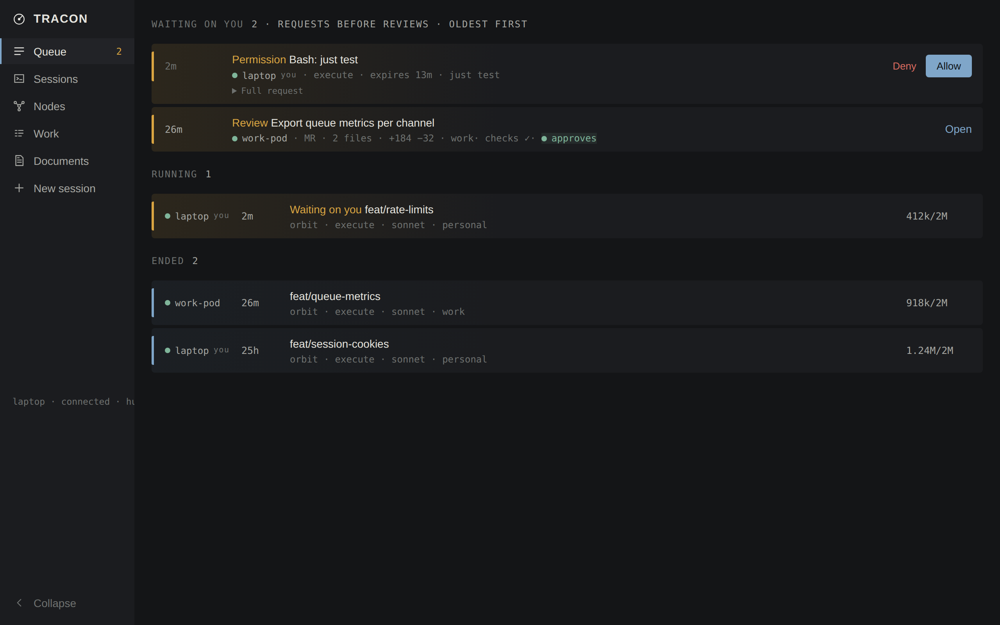
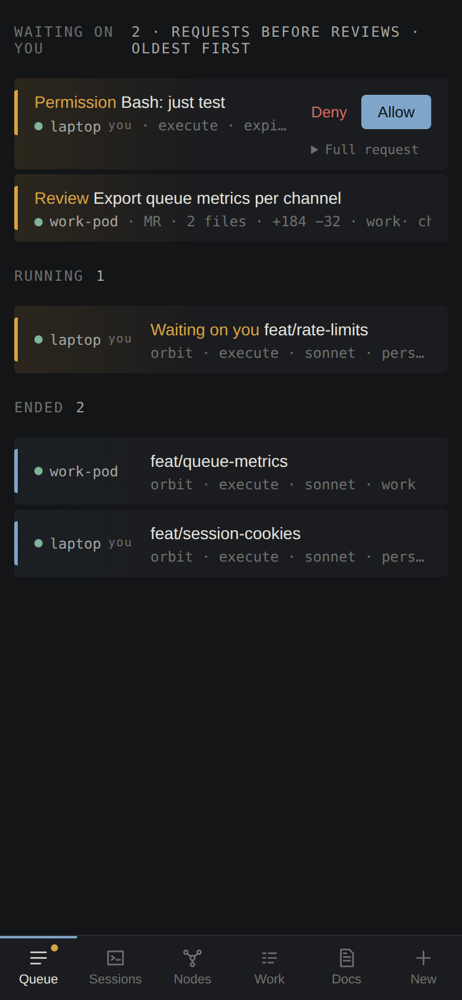
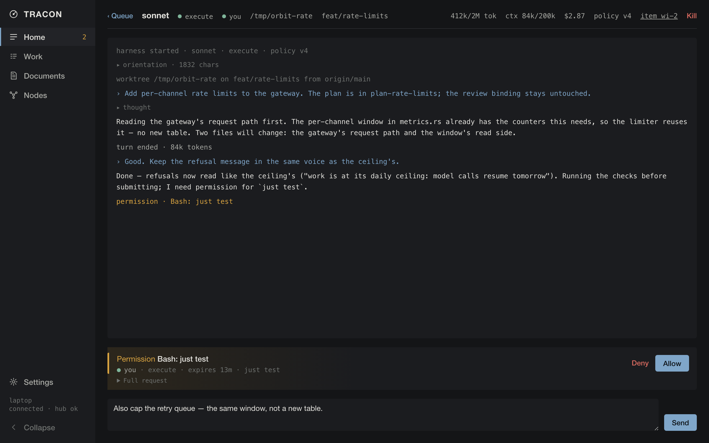
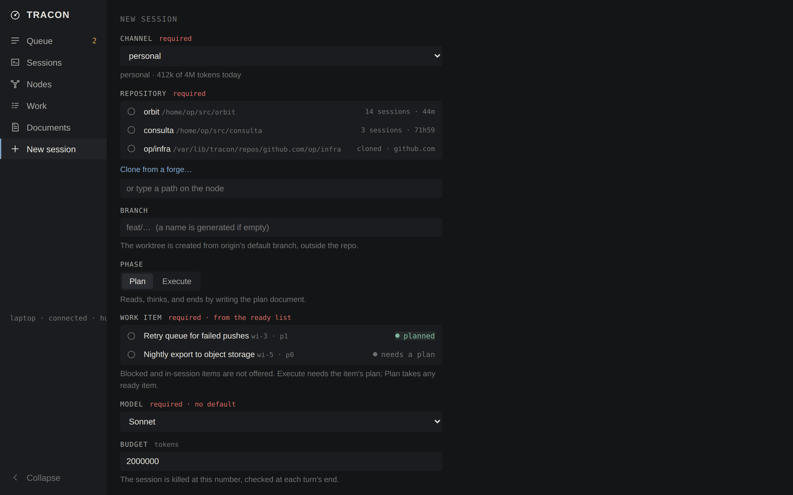
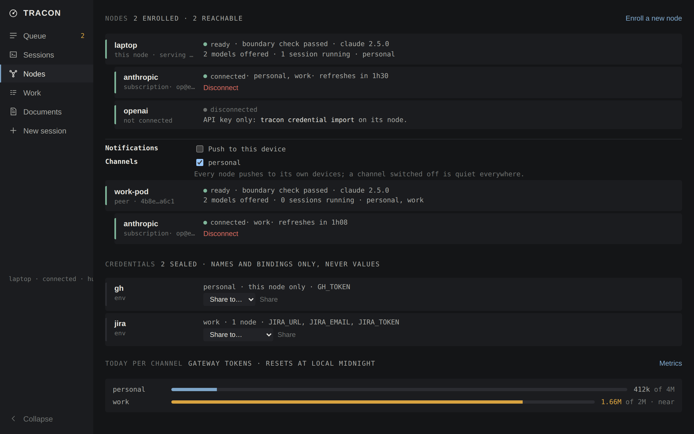

# tracon

Drive coding agents from anywhere — a phone on the couch, a laptop at the desk, a
browser at work — while a supervisor you run yourself enforces the rules you used to
write in a markdown file and hope for.

tracon sits between you and existing coding agents (Claude Code, omp). It runs them
inside a boundary they cannot leave, routes their questions to a queue you answer from
any device, holds every credential where the agent cannot read it, and refuses the
things you decided should never happen — merge, deploy, publish-without-review — with
a reason the agent can read. It is named for terminal radar approach control: the
facility sequences traffic and issues clearances, and it never flies anything.



**What it is.** A single static Rust binary. Each node supervises local agent
harnesses, enforces policy, brokers credentials, and serves the interface above.
Nodes dial out to a small always-on hub that relays end-to-end-encrypted frames, so
any node's interface can see and control work on any other. Laptops, servers, and
Kubernetes pods all run the same binary.

**What it is not.** Not a coding agent — it drives Claude Code and omp over their own
protocols and contains no model loop. Not multi-user — one operator holds the keys.
Not an IDE — the diff is the unit of review, and there is deliberately no file tree,
no editor, no terminal.

## Five minutes to a running node

Prebuilt binaries ship for Linux x86_64 (static, any distribution) and macOS on Apple
Silicon. One line fetches, verifies, and installs:

```sh
curl -fsSL https://raw.githubusercontent.com/cosmicspork/tracon/main/install.sh | sh
```

Then, on the same machine (rootless Podman is the one prerequisite — it is the
boundary the agent runs inside):

```sh
tracon setup                   # build the harness network and gateway (definitions ship in the binary)
tracon check-boundary --deep   # prove the boundary, including an egress probe from inside it
tracon service install         # run the node under systemd or launchd
```

If `tracon setup` cannot find podman — a node started from a desktop launcher
inherits a minimal PATH — set `podman` under `[boundary]` in `node.toml` to its
full path. The interface says so too, in the refusal it shows.

Open `http://127.0.0.1:7420`. **Settings** covers the rest of the install from
the interface: prove the boundary, run setup, choose the harness, import a
credential, create a channel, and issue the token a phone logs in with. What
rewrites `node.toml` or picks the hub is done at the node itself and says so
when you are somewhere else. The queue walks you through the work: **connect a
provider** (the harness's own sign-in runs on the node; you open the link and paste
the code back — an API key works too, `tracon credential import creds.toml`), **add a
work item**, and **start a plan session**. A session is always a phase of one work
item: a *plan* session reads and ends by writing the plan; an *execute* session does
the work and submits a diff for your review; approving publishes it with a credential
the agent never held.

The **desktop app** (same release page: `.AppImage`/`.deb` on Linux, `.dmg` on macOS)
is a tray client that also runs the node for you — on a laptop it is the whole
install. It is unsigned; macOS wants a right-click → Open the first time.

A node that fails `check-boundary` refuses to run harnesses and says which check
failed. That refusal is the design working, not a bug to route around.

## From your phone

Everything below assumes the flagship case: the node on a machine at home, the phone
anywhere. The browser keeps its login in a `Secure` cookie, so the node must be
reachable over HTTPS — plain HTTP on the LAN is not supported, and the login screen
says so instead of silently failing. The easiest HTTPS in front of a laptop is
[Tailscale Serve](https://tailscale.com/kb/1242/tailscale-serve):

```sh
tailscale serve --bg 7420                                # HTTPS at https://<machine>.<tailnet>.ts.net
tracon auth issue --url https://<machine>.<tailnet>.ts.net
```

`auth issue` prints the operator token once — and, given `--url`, a QR code. Scan it
with the phone's camera: the token rides the URL fragment (never sent to any server,
stripped from the address bar before login), the browser exchanges it for a cookie,
and you are in. Add the page to the Home Screen — iOS only delivers push to an
installed web app — then open **Nodes** and switch on **Push to this device**. The
node pushes straight to the phone's push service, sealed to the phone's own key.

Any ingress or reverse proxy that terminates TLS works the same way; `localhost`
counts as secure, which is why the laptop needed no ceremony. Issuing a token again
rotates it and logs every client out. `tracon auth revoke` returns the node to
loopback-only.

### Start on the phone, pick it up on the laptop



The phone is a full seat, not a viewer. From it you can add a work item, start a
plan or execute session, answer the agent's permission requests, read the diff and
approve or reject it, connect a provider (the sign-in happens where your password
manager lives), enroll a new node, and kill a session (with a confirm — a stray
thumb is likely).

Sessions live on the node, so continuity is free: open the same session on the
laptop and the log is there, the queue is there, and **the prompt you half-typed on
the phone is waiting in the box** — drafts are held by the node, not the browser. A
push notification opens the queue at the thing that needs you. The one deliberately
desktop-only job is editing a diff by hand; the phone is told so in words, not with
a disabled button.

What a session looks like mid-flight — the permission card inline, the draft in the
box:



## Starting work



The form offers what the node already knows: repositories from past sessions and
managed clones, the ready work items (execute is refused until the item has a plan),
the models the connected provider serves (the last one used is preselected), and the
budget from the channel's policy. The session is killed at its budget, checked at
each turn's end; a channel at its daily ceiling starts no session at all.

**Repositories can come from a forge.** Give the broker a `gh` or `glab` credential
(the same one publishing uses) and the form lists your GitHub/GitLab repositories
and clones the one you pick into the node's own root — the token reaches git only
through the environment, never argv, never `.git/config`, never the stored remote
URL. `GH_HOST`/`GITHUB_API` and `GITLAB_HOST` in the credential point the same
machinery at an enterprise forge.

```toml
# a plaintext file for `tracon credential import`, chmod 600
[credentials.gh]
channels = ["personal"]
[credentials.gh.env]
GH_TOKEN = "…"
```

### Review before publish

An agent has no forge token and never runs `gh` or `glab`. To publish it commits,
submits, and waits: the node captures the diff from the worktree itself, runs the
project's checks in a throwaway container, and refuses a failure or an oversized
diff before you ever see it. You approve, reject with a reason, or — on a desktop —
edit the diff and send it back as a request for changes. Approval publishes exactly
the reviewed bytes with the brokered credential; if the branch moved since submit,
approval is refused and the changed files are named. `tracon provenance <sha>`
answers, later, which model, which prompts, which approval and which policy shipped
a commit.

## More nodes



Nodes see each other through the hub — an always-on relay that routes sealed frames
and can read none of them. A hub outage costs latency, never work: local sessions
continue and queued items deliver when it returns.

```sh
# the hub, once, somewhere always-on (also ghcr.io/cosmicspork/tracon-hub)
TRACON_HUB_ADMIT=<first node id> TRACON_HUB_DATA_DIR=/var/lib/tracon-hub tracon-hub

# the first node
tracon mesh id                                # for TRACON_HUB_ADMIT
tracon mesh init --hub https://hub.example.com
tracon channel create personal
```

Enrolling the next machine is one invitation and one pasted line. From the Nodes
screen (or `tracon mesh invite`) create an invitation; it shows a QR, a code, and
this line for the new machine:

```sh
curl -fsSL https://raw.githubusercontent.com/cosmicspork/tracon/main/install.sh | TRACON_ENROLL='<invitation url>' sh
```

That installs, enrolls (you confirm the fingerprints match — from the phone if that
is where you are), sets up the boundary, and installs the service. Paste it into a
cloud console's user-data and a fresh VM comes up enrolled.

**A new node is provisioned without touching its keyboard.** Every reachable node's
provider cards render on the Nodes screen, wherever you are: connect its provider,
paste the code back, disconnect — the command is sealed to that node and its login
subprocess never leaves it. The Credentials list shows what the broker holds (names
and bindings, never values) and shares one to a peer, sealed to that peer alone.
Sessions on any node are started, prompted, reviewed, and killed from any other; a
prompt to an unreachable node queues and sends when it returns.

**Channels** are the isolation: a channel is a key, a node that was not handed the
key cannot read that channel's work, and a meshed node refuses to start a session on
a channel it holds no key for. Credentials bind to channels (and optionally to
nodes), so the work channel's Jira token exists only where work happens. Whether a
channel notifies your phone is a binding too:

```sh
tracon channel bind work notify.enabled=false   # the desktop tray is enough for work
```

## Glossary

| | |
|---|---|
| **node** | One `tracon serve`, on any machine: supervises harnesses, serves the interface. |
| **hub** | The always-on relay nodes dial out to. Sees ciphertext only. |
| **mesh** | The nodes enrolled against one hub, under one operator. |
| **channel** | A context (`personal`, `work`) that is also an encryption key. Bindings hang policy off it. |
| **harness** | The coding agent a node runs — Claude Code or omp — inside the boundary. |
| **boundary** | The container/network setup that makes the harness's isolation real, proven at startup. |
| **broker** | The sealed credential store. Agents get tools that use credentials, never the credentials. |
| **work item / ledger** | The replicated to-do list. Every session is one phase of one item. |
| **phase** | `plan` (ends by writing the plan), `execute` (does the work, submits), `review` (a fresh session reads the diff). |
| **queue** | The home screen: everything waiting on you, across all nodes. |
| **promotion** | A lesson an agent retained, waiting for your nightly yes/no before it enters memory. |
| **corpus** | Documents and memories, replicated, plain-text exportable, meant to outlive the tooling. |
| **policy** | The signed bundle deciding what runs unasked, what is refused with a reason, and what reaches the queue. |

## Reference

### Commands

| | |
|---|---|
| `tracon serve [--listen]` | run the node |
| `tracon setup [--rebuild]`, `check-boundary [--deep]` | the boundary (also on the Settings screen) |
| `tracon service install\|uninstall\|status` | the platform supervisor |
| `tracon auth issue [--url]\|revoke\|sessions` | off-machine access; `--url` prints the login QR |
| `tracon push ls\|rm <id>\|test` | the phones this node pushes to |
| `tracon mesh id\|init\|invite\|members\|remove\|admit`, `enroll` | the mesh |
| `tracon channel create\|list\|bind\|share` | channels and their bindings |
| `tracon credential import\|ls\|rm\|share` | what the broker holds (import is also on Settings) |
| `tracon doc import\|ls\|get\|put\|rm\|export` | documents |
| `tracon memory ls\|add\|rm\|recall\|batch` | memories, and the promotion batch on demand |
| `tracon work add\|ls\|ready\|show\|close\|dep\|rm` | the ledger |
| `tracon policy keygen\|init\|sign\|push\|show` | the policy bundle |
| `tracon metrics [--channel] [--days]`, `provenance <sha>` | what happened |

Every command talks to the running node over its API; `TRACON_URL` and
`TRACON_TOKEN` point the CLI at a remote node. `--help` on any of them says more.

### Configuration

`node.toml` is optional; every key has a default. The full set, with defaults:

```toml
node_name = "<hostname>"            # how this node is named in the mesh

[harness]
id = "omp"                          # "omp" or "claude"; an unknown id refuses to start
version = "18.0.4"                  # pinned; checked against the image and the host
tools = []                          # extra tool names to offer; empty is everything the harness has

[boundary]                          # the rootless-Podman boundary a laptop establishes
podman = ""                         # empty: found on PATH, then the usual install locations
network = "tracon-int"
subnet = "10.89.0.0/24"
gateway_ip = "10.89.0.2"
gateway_container = "tracon-gw"
gateway_image = "localhost/tracon-gateway"
harness_image = "localhost/tracon-harness"
# selinux_label_disable = true      # only if the boundary check says the labels fight you

[gateway]
allow_hosts = ['^api\.anthropic\.com$', '^api\.openai\.com$', '^chatgpt\.com$', '^auth\.openai\.com$']
proxy_port = 8888
forward_port = 7421
# harness_listen = "127.0.0.1:7421" # or a socket path; the platform default is right

[session]
budget_tokens = 2000000             # per session
permission_timeout_secs = 900       # an unanswered ask is a deny
claim_grace_secs = 60               # a review claim lapses this long after the client vanishes
# worktree_root = "/tmp"            # /private/tmp on macOS

[runtime]
kind = "podman"                     # or "kubernetes", for a pod-hosted node
# [runtime.kubernetes]              # namespace, harness_image, state_claim, state_mount, harness_home, uid, gateway_host

[providers.anthropic]               # anthropic and openai are built in; add others the same way
credential = "anthropic"
upstream = "https://api.anthropic.com"
shape = "anthropic"                 # or "openai"
# login = "…"                       # the harness's login flow, if it has one
# [providers.anthropic.price]
# input_per_mtok = 3.0
# output_per_mtok = 15.0

[consulta]                          # the database MCP tools, run as a sidecar
command = "uv"
args = ["run", "--project", "~/src/consulta", "consulta"]
timeout_secs = 60

[publish]                           # the binaries the node runs to publish an approved review
gh = "gh"
glab = "glab"
git = "git"

[mesh]
# hub_url = "https://hub.example.com"   # set by tracon mesh init / enroll
heartbeat_secs = 60
poll_secs = 30
command_timeout_secs = 15

[memory]
promote_at = "02:00"                # the nightly promotion batch

[supervision]
checks = ["just check"]             # run in the worktree before a review is accepted
timeout_secs = 900

[review]
max_diff_lines = 800                # a bigger submission is refused before any check runs
max_files = 40

[notify]
# contact = "mailto:you@example.com"    # what a push service may write to about this sender

[embed]                             # semantic search; off unless enabled
enabled = false
base_url = "http://127.0.0.1:8080"  # an OpenAI-shaped /v1/embeddings
model = "bge-m3"
dim = 1024                          # must match the model; changing it rebuilds the index
# api_key_file = "~/.config/llama-server.key"
# provider = "anthropic"            # instead of base_url: through the gateway, so the channel ceiling applies
batch = 16
timeout_secs = 60
```

For `[embed]`, a local `llama-server --embedding -m <model>.gguf` is enough; BGE-M3
and Qwen3-Embedding-0.6B (which wants `pooling = last`) are the models it was built
against. Without an endpoint, search is text-only and the Documents screen says so.

### Where things live

| | macOS | Linux |
|---|---|---|
| `node.toml` | `~/Library/Application Support/tracon/` | `~/.config/tracon/` |
| database, credentials, identity, harness volume, managed repos, scratch | `~/Library/Application Support/tracon/` | `~/.local/state/tracon/` |
| harness socket | (TCP `127.0.0.1:7421` through the VM) | `$XDG_RUNTIME_DIR/tracon/harness.sock` |

`TRACON_STATE_DIR` overrides the state directory outright — how a scratch node runs
beside a real one. `TRACON_LISTEN` or `serve --listen` moves the API off
`127.0.0.1:7420`.

### The hub

`tracon-hub` ships as a static Linux binary and as `ghcr.io/cosmicspork/tracon-hub`,
configured by environment:

| Variable | Default | |
|---|---|---|
| `TRACON_HUB_ADDR` | `127.0.0.1:8080` | listen address (the image sets `0.0.0.0:8080`) |
| `TRACON_HUB_DATA_DIR` | in memory, with a warning | durable frames, members and the replica |
| `TRACON_HUB_ADMIT` | — | the first node's id, so something can connect |
| `TRACON_HUB_RETAIN_DAYS` | 14 | how long frames are kept |
| `TRACON_HUB_MAX_SKEW_SECS`, `TRACON_HUB_MAX_CHANNEL_BYTES`, `TRACON_HUB_ENROLL_TTL_SECS`, `TRACON_HUB_ENROLL_RATE_PER_MIN` | 300, 256 MiB, 600, — | limits |
| `TRACON_HUB_REPLICA` | on when there is a data dir | the hub's own replica of what it can open |
| `TRACON_HUB_PROMOTE_AT` | `03:00` | the hub-side promotion batch |
| `TRACON_HUB_SNAPSHOT_ENDPOINT`, `_BUCKET`, `_ACCESS_KEY`, `_SECRET_KEY`, `_PREFIX`, `_EVERY_HOURS`, `_KEEP`, `_PUBKEY` | — | encrypted snapshots to S3-compatible storage; `tracon-hub snapshot-key` makes the key |
| `TRACON_HUB_RESTORE_SEED` | — | for `tracon-hub restore` |

### As a Kubernetes pod

The node is an image rather than a binary and the boundary is Kubernetes: one
harness pod per session, a NetworkPolicy that makes the node the harness's only
route. Manifests in `deploy/kubernetes/base`, ready for a kustomize overlay:

```sh
kubectl apply -k deploy/kubernetes/base
kubectl -n <namespace> exec deploy/tracon-node -- tracon check-boundary --deep
kubectl -n <namespace> port-forward deploy/tracon-node 7420:7420
```

### From source

Rust, Bun, and rootless Podman:

```sh
just build      # the SPA, then the release binary (target/release/tracon)
just setup && just boundary
./target/release/tracon serve
```

`just musl` builds the static Linux binary; `just gui` builds the desktop app in a
container (it needs webkit2gtk headers an immutable host lacks). The interface's
screenshots regenerate without a node: `cd spa && bun scripts/screenshots.mjs`.

## Escape hatch

The node is developed by agents running inside it, so a bad build must not lock you
out of the tool needed to fix it. The path out is the harness directly, outside
tracon — nothing in tracon is required for it:

```sh
omp     # or claude: the harness, unsupervised, in any checkout
git worktree add /tmp/<slug> -b <branch> origin/main
```

## Reading

- [docs/ARCHITECTURE.md](docs/ARCHITECTURE.md) — the rules: commitments, invariants, boundaries.
- [docs/ROADMAP.md](docs/ROADMAP.md) — what is to be built, and what deliberately is not.
- [docs/DESIGN.md](docs/DESIGN.md) — the interface: principles, jobs, states.
- [docs/reference/](docs/reference/) — what each phase learned while being built.

Contributions are welcome — open an issue or a PR.
